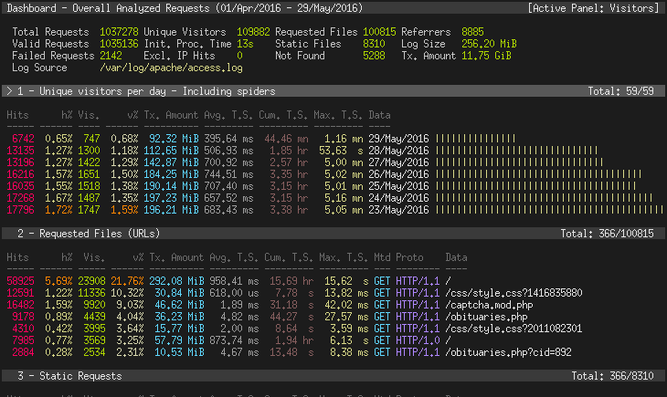

# Analysing nginx logs using go-access

[GoAccess](https://goaccess.io/get-started) is a great tool to help visualise and analyse network traffic from nginx logs.

{: .center}

## Install

You have a few different options for installation, here I describe the option for Linux, which is the same for WSL2

```bash
sudo apt-get update && sudo apt-get upgrade -y
sudo apt-get install goaccess -y
```

## Usage

Navigate to the directory of your log file (or you can use the  full path to the file or an alias)

Then simply run goaccess:-

```bash
# Static Analysis of Logs
goaccess access.log -c

# Stream live logs to HTML report
goaccess access.log -o /var/www/html/report.html --log-format=COMBINED --real-time-html
```

### NOTE for Live Streaming logs

You should place your report.html output file under your Web Server document root.

You should be able to simply open your report.html by navigating the browser to your document root URL. e.g., http://example.com/report.html

GoAccess features its own Web Socket server and that's how it pushes the latest data to the browser.

If you don't run a Web Server to host your report.html, you can simply open the output file through your browser (Ctrl+o).