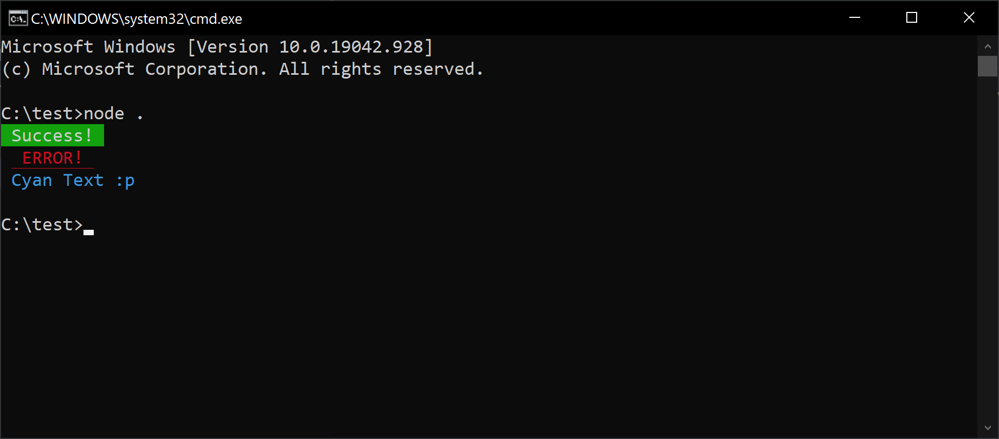

# Console Logging with Colour in Node

This trick leverages string interpolation where `%s` is the value we are injecting.

You only need to set the colour once, all further logs will use the colour chosen.

You can use the arg `\x1b[0m` to reset the terminal colour back to default.

```javascript
console.log("\x1b[42m %s \x1b[0m", 'Success!');         // Green
console.log("\x1b[31m \x1b[4m %s \x1b[0m", 'ERROR!');   // Red & Underscored
console.log("\x1b[36m %s \x1b[0m", "Cyan Text :p");     // cyan
```
Result:

{: .center}

## Colour reference

Below you can find colours reference of commands you can use when running node.js application:

| Value         | Result     |
| ------------- | ---------- |
| `\x1b[0m`  | Reset      |
| `\x1b[1m`  | Bright     |
| `\x1b[2m`  | Dim        |
| `\x1b[4m`  | Underscore |
| `\x1b[5m`  | Blink      |
| `\x1b[7m`  | Reverse    |
| `\x1b[8m`  | Hidden     |
| `\x1b[30m` | FgBlack    |
| `\x1b[31m` | FgRed      |
| `\x1b[32m` | FgGreen    |
| `\x1b[33m` | FgYellow   |
| `\x1b[34m` | FgBlue     |
| `\x1b[35m` | FgMagenta  |
| `\x1b[36m` | FgCyan     |
| `\x1b[37m` | FgWhite    |
| `\x1b[40m` | BgBlack    |
| `\x1b[41m` | BgRed      |
| `\x1b[42m` | BgGreen    |
| `\x1b[43m` | BgYellow   |
| `\x1b[44m` | BgBlue     |
| `\x1b[45m` | BgMagenta  |
| `\x1b[46m` | BgCyan     |
| `\x1b[47m` | BgWhite    |
