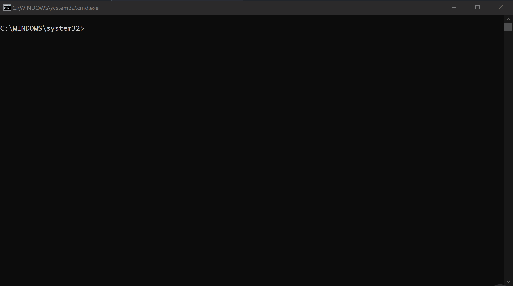

# Cleaning up node_modules

Use npkill to cleanup node_modules system wide 😎

{: .center}

It's common to see over 1GB easily recoverable for old projects, you can always `npm i` them again!

## npkill Usage

Simply run `npx npkill`

## npkill Switches

```pre
-c, --bg-color          Change row highlight color.
                        Options: blue, cyan, magenta, red, white and yellow.
                        Default is blue.

-d, --directory         Set directory from which to start searching.
                        By default, starting-point is .

-D, --delete-all        CURRENTLY DISABLED.
                        Automatically delete all node_modules folders found.

-e, --show-errors       Show error messages if any.

-E, --exclude           Exclude directories from search
                        (directory list must be inside double quotes "", each
                        directory separated by "," ) Example: "ignore1, ignore2"

-f, --full              Start searching from the home of the user
                        (example: "/home/user" in linux).

-gb                     Show folder size in Gigabytes

-h, --help, ?           Show this help page, with all options.

-nu, --no-check-update  Dont check for updates on startup.

-s, --sort              Sort results by: size or path

-t, --target            Set the name of the directory you want to search for
                        (by default, it's node_modules)

-v, --version           Show version.

```
