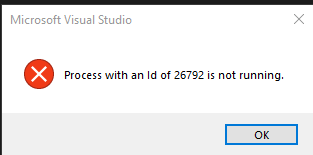

# [FIX] IIS: The specified port is in use (50309, 53215 etc)

Have you seen the dreaded message...

```
Port '50309' (or similar) is already being used by another application
```

Or even...

{: .center-port}

---

# Problem

When attempting to run AppStore, or other solutions that use high development port ranges, alongside Hyper-V being enabled, IIS will complain that something is already using port 50309.

# Cause

Hyper-V & Docker each reserve various port ranges in order to function normally, sadly, these ranges can collide with the ones you are trying to use.

# Solution

To resolve this issue, you will need to reserve the ports surrounding the ones you require.... :)

1. Uninstall Docker
2. Disable Hyper-V (Will Reboot)

    ```batchfile
    BCDEDIT /Set {current} hypervisorlaunchtype off
    ```

3. Remove the Hyper-V feature from windows (Will Reboot)

    ```batchfile
    dism.exe /Online /Disable-Feature:Microsoft-Hyper-V
    ```

4. Run the batchfile below as an administrator:

    ```batchfile
    dism /online /get-features | find /i "Microsoft-Hyper-V" && (
        start /wait "" netsh int ipv4 set dynamicport tcp start=20000 num=16384
        start /wait "" netsh int ipv4 set dynamicport udp start=20000 num=16384
        start /wait "" reg add HKLM\SYSTEM\CurrentControlSet\Services\hns\State /v EnableExcludedPortRange /d 0 /f
        goto :eof
    )
    start /wait "" netsh int ipv4 set dynamicport tcp start=49152 num=16384
    start /wait "" netsh int ipv4 set dynamicport udp start=49152 num=16384
    start /wait "" reg delete HKLM\SYSTEM\CurrentControlSet\Services\hns\State /v EnableExcludedPortRange /f
    ```

5. Re-install Hyper V (Will reboot)

    ```batchfile
    dism.exe /Online /Enable-Feature:Microsoft-Hyper-V /All
    ```

6. Re-install Docker, Update it & Enable WSL2

7. Run `bcdedit /set hypervisorlaunchtype auto` in an administrator prompt

8. Reboot now

9. Finally, run the batch file once more for good measure..!

Now, Hyper-V should respect your range of exclusions, working around them when creating it's dynamic port exclusions.

You may now try to run your solution with AppStore again.

### Alternative Fix (WSL2 For Docker)

To use this feature, update Docker to min v2.3.0.2, accepting the prompt to configure Docker to use WSL2.

The commands below should be run via PowerShell:

1. Install WSL via Windows Features (Turn Windows Features On or Off)

2. Enable WSL:

    ```batchfile
    Enable-WindowsOptionalFeature -Online -FeatureName Microsoft-Windows-Subsystem-Linux
    ```

3. Enable VM Platform:

    ```batchfile
    Enable-WindowsOptionalFeature -Online -FeatureName VirtualMachinePlatform
    ```

4. Check current version for your distro

    ```batchfile
    wsl -l -v
    ```

5. Install the WSL2 [Patch here](https://wslstorestorage.blob.core.windows.net/wslblob/wsl_update_x64.msi)

6. Set the distro to use WSL2:

    ```batchfile
    wsl --set-version DistroName 2
    ```

7. Ensure WSL2 is the default kernel:

    ```batchfile
    wsl --set-default-version 2
    ```

You will enjoy a few reboots during this process; grab a cuppa!

### UPDATE

Microsoft have now responded with an undocumented registry key (`EnableExcludedPortRange`) that will force hyper-v to respect port ranges generally used by developers.

Atop the steps above, you can also run the below batch file to adjust this behaviour:-

```batchfile
dism /online /get-features | find /i "Microsoft-Hyper-V" && (
start /wait "" netsh int ipv4 set dynamicport tcp start=20000 num=16384
start /wait "" netsh int ipv4 set dynamicport udp start=20000 num=16384
start /wait "" reg add HKLM\SYSTEM\CurrentControlSet\Services\hns\State /v EnableExcludedPortRange /d 0 /f
goto :eof
)
start /wait "" netsh int ipv4 set dynamicport tcp start=49152 num=16384
start /wait "" netsh int ipv4 set dynamicport udp start=49152 num=16384
start /wait "" reg delete HKLM\SYSTEM\CurrentControlSet\Services\hns\State /v EnableExcludedPortRange /f
```
